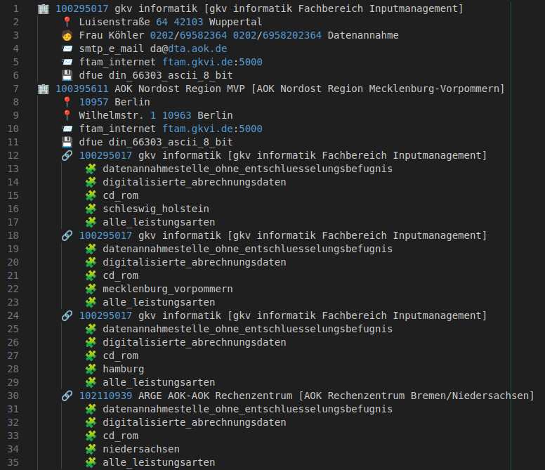

# NetBrothers Kostenträgerdatei Parser

A small PHP library and CLI for parsing GKV "Kostenträgerdateien", files
describing cost bearer responsibilities and capabilities within the German
statutory health insurance environment.

The project provides parsers for two variants:

- Pflege Leistungserbringer (SGB XI) — parsed by the `PflegeParser` and exposed via the `netbrothers:kostentraeger-pflege` command.
- Sonstige Leistungserbringer (SGB V) — parsed by the `SonstigeParser` and exposed via the `netbrothers:kostentraeger-sonstige` command.

These commands are available as executable scripts in the `bin/` directory and
as `vendor/bin/` commands when the project is installed via Composer.

## Requirements

- PHP 8.3 or later

Development dependencies include PHPUnit, PHPStan and PHP CS Fixer.

## Installation

1. Clone the repository:

```shell
git clone https://github.com/netbrothers-gmbh/kostentraegerdatei-parser.git
cd kostentraegerdatei-parser
```

2. Install dependencies:

```shell
composer install
```

After installing, the CLI wrapper scripts in `bin/` should be executable and
ready to use on Unix-like systems.

## Usage

There are two entry points (see `bin/`):

- `bin/kostentraeger-pflege` — runs the SGB XI parser
- `bin/kostentraeger-sonstige` — runs the SGB V parser

These scripts will be exposed as follows, when installed as a dependency in your
own project.

- `vendor/bin/kostentraeger-pflege`
- `vendor/bin/kostentraeger-sonstige`

Both scripts accept the same arguments and option.

### Arguments

- `filePath` (required) — Path to a Kostenträgerdatei file (examples: `AO05Q425.ke0`, `AO06Q425.ke0`).
- `ikNumber` (required) — The IK (Institutskennzeichen) to print. Use `"all"` instead to print the parsed contents of the whole file.

### Options

- `--cost-bearer`, `-c` — If specified and the IK exists, the command prints only the cost bearers (Kostenträger) of the given entity (if available).

### Examples

Print a single institution by IK using the SGB XI parser (via the bin wrapper):

```shell
php bin/kostentraeger-pflege path/to/AO06Q425.ke0 123456789
```

Print all institutions contained in a file:

```shell
php bin/kostentraeger-pflege path/to/AO06Q425.ke0 all
```

Print only the cost-bearer (Kostenträger) of a given IK:

```shell
php bin/kostentraeger-pflege path/to/AO06Q425.ke0 123456789 --cost-bearer
```

The same usage applies for the SGB V parser using `bin/kostentraeger-sonstige`.

### Output

The commands print a textual representation of the parsed `Institution`.



## Kostenträger File Format

The parser expects standard GKV Kostenträgerdateien (files typically named like
`AO05Q425.ke0`, `AO06Q425.ke0`, etc.).

## Development

### Run tests with PHPUnit

```shell
vendor/bin/phpunit
```

### Run static analysis with PHPStan

This command will perform a static analysis of the project according to the
configuration in `phpstan.dist.neon`.

```shell
vendor/bin/phpstan analyse
```

### Fix coding style with PHP CS Fixer

```shell
vendor/bin/php-cs-fixer fix
```

## License

This project is licensed under the [LGPL-3.0-or-later](https://spdx.org/licenses/LGPL-3.0-or-later.html) license.

## Support / Feature Requests

If you need help integrating the parser, want additional output formats (e.g.
JSON), or want the parsers exposed as a library API, feel free to contact us,
open an issue or submit a PR.

## Author

[Thilo Ratnaweera, NetBrothers GmbH](https://netbrothers.de)

[](https://netbrothers.de)
